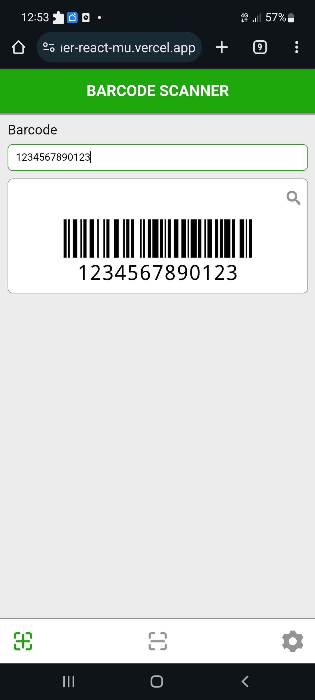

<h1 align="center">Barcode scanner</h1>

<h2>About project</h2>

This application allows you to scan a product's barcode and find information about it on the Internet. The application was created using the React, QuaggaJS and JsBarcode libraries.

<h2>Features</h2>
<ul>
  <li>
    <h3>Create barcode</h3>
    
Allows to create a barcode image based on the value entered by the user.

    
  </li>
    <li>
    <h3>Barcode scanning</h3>
    
It is possible to scan the barcode from the product.

    
     
  </li>
    <li>
    <h3>Camera selection</h3>
    
There is an option to select a camera for scanning.

    
  </li>
</ul>

<h2>Technology Stack</h2>
<ul>
  <li>React</li>
  <li>SCSS</li>
  <li>QuaggaJS</li>
  <li>JsBarcode</li>
</ul>
